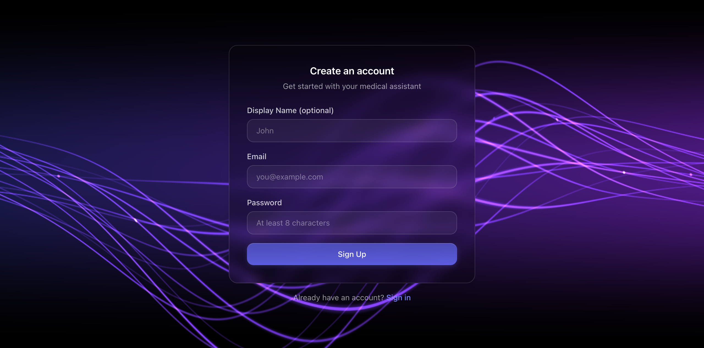
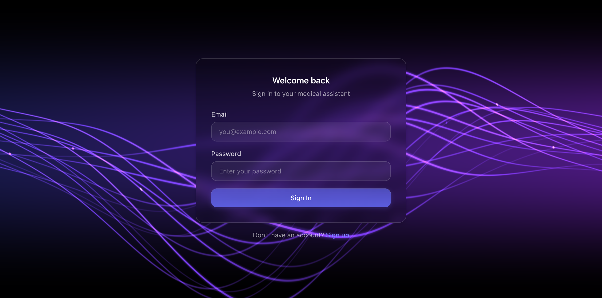
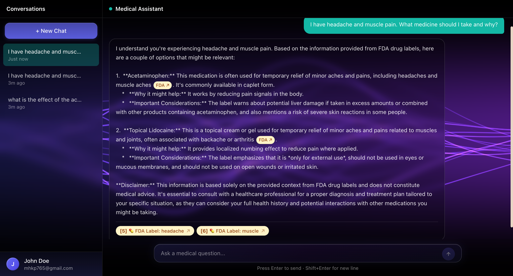

# ch-4 Personal Project — Report

## Project

- **GitHub username:** @mhkaungpyae
- **Repo URL:** https://github.com/mhkaungpyae/Medical_Citation_Chatbot
- **Live / download URL:** https://medical-citation-chatbot.vercel.app/
- **License:** MIT
- **One-line summary:** Generative RAG chatbot that answers any medical question using live Wikipedia and OpenFDA data, streamed through a local MedGemma model with clickable citations.

## Product-Intro Slides

- **Slides path:** slides/intro.md

## Demo Screenshots

- **Resolution used:** 1280×800 desktop





## Notes (optional)

**How to run locally:**

```bash
# Backend
cd backend
source .venv/bin/activate
pip install -r requirements.txt
ollama pull medgemma1.5:4b-it-q8_0
cd .. && find backend -type d -name __pycache__ -exec rm -rf {} + && PYTHONPATH=. uvicorn backend.main:app --reload --port 8000

# Frontend
cd frontend
npm install
npm run dev
```

**Requirements:**
- Python 3.12+, Node.js 18+, Ollama running locally
- Supabase project with `chat_sessions` and `messages` tables
- Environment variables: `SUPABASE_URL`, `SUPABASE_KEY` in `backend/.env`; `NEXT_PUBLIC_SUPABASE_URL`, `NEXT_PUBLIC_SUPABASE_ANON_KEY` in `frontend/.env.local`

**Known rough edges:**
- Heuristic drug extraction can miss uncommon drug names or pick up non-drug capitalized words
- OpenFDA returns no results for some drugs (especially OTC supplements or herbal remedies)
- The local MedGemma 4B model occasionally produces verbose or repetitive answers
- No rate limiting on the `/api/chat` endpoint beyond Ollama's natural latency
